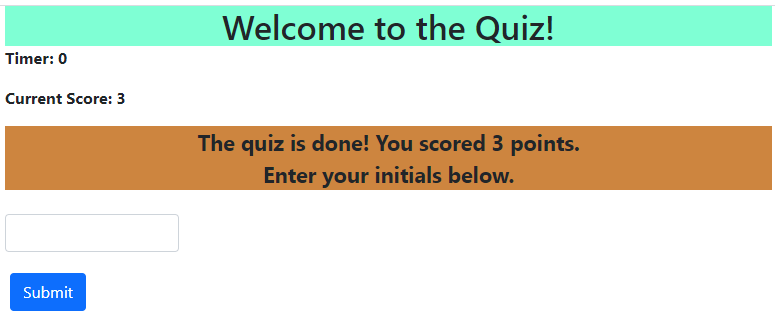

# JavaScriptQuiz
## Description
The goal of this project was to create a timed quiz, covering JavaScript fundamentals, that recorded a user's score and provided feedback messages each time they answered a question.

## Acceptance Criteria
1. Users are presented with a question upon starting the quiz, and the quiz timer begins.
2. When a user answers a question, they receive feedback (positive or negative) on their answer.
3. If a user answers correctly, they receive a point for that answer. 
4. If a user answers incorrectly, they receive a time penalty. (Time is subtracted from their current time remaining.)
5. The quiz ends whenever the user answers all available questions or their timer reaches 0.
6. The user is provided with their score and is prompted to enter their intials.
7. The user may view a list of current recorded scores.  

## Solution
To provide question and answer choices for this quiz, a question bank array was created within the JavaScript file. The array was a collection of objects, each containing the following name/value pairs:

* question
* answer
* correctAnswer

**Example of a question object Loop:** 

    {
        question:  "Variables are made up of:",
        answer: ["a vowel and consonant", "an object and a location", "a name and a value"],
        correctAnswer: "a name and a value",
    }

Global variables were also created for the quiz timer (timer), the number of questions asked (questionCount), the user's current score (currentScore), and an empty array for storing use scores (highScores). 

### Dyanmically Populated Content
One of the challenges of this project was to dynamically populate question and answer choice content. This is necessary when the quiz starts and after the user answers each question. Empty HTML elements served as placeholders for this content, and then jQuery selectors were used to target and place the necessary information.

**HTML elements for question and answer content**

    <section class="row">
            <article id="quizContent">
                

                

            </article>
    </section>

**Function used to add quiz content**

    function addContent() {
   
    if ((questionCount < questionBank.length) && (timer > 0)) {
        $("#questionContent").text(questionBank[questionCount].question);

        for (i = 0; i < questionBank[questionCount].answer.length; i++) {
            var button = $("<button>");
            button.text(questionBank[questionCount].answer[i]);
            button.addClass("choice btn btn-secondary");
            button.val(questionBank[questionCount].answer[i])
            $("#answerContent").append(button);
        }}

    else {
        $("#questionContent").text("The quiz is done! You scored " + currentScore + " points.");
        $("#questionContent").addClass("done");
        $("#answerContent").text("Enter your initials below.");
        $("#answerContent").addClass("done");
        $("#userForm").addClass("visible").removeClass("hidden");
        timer = 0;
    }}

### Recording User Initials
When a user completes the quiz, they are prompted to enter their intials so they may track their progress against others. 

The intials input by the user, as well as their current quiz score, are recorded in a variable and pushed to the highScores array for later retrieval. 

    var newScore = {"initials": userInitials.value, "score": newScore};
    highScores.push(newScore);

### Viewing Scores

## Location
Use the following link to access the repository associated with this project: [JavaScript Repository](https://github.com/larrygjenkins/JavaScriptQuiz.git)

Use the following link to access the JavaScript Quiz application: [JavaScript Quiz](https://larrygjenkins.github.io/JavaScriptQuiz/)

## Example Images
Following is an image of the password generator before a new password is created:

Following is an image of the password generator after a new password is created:

